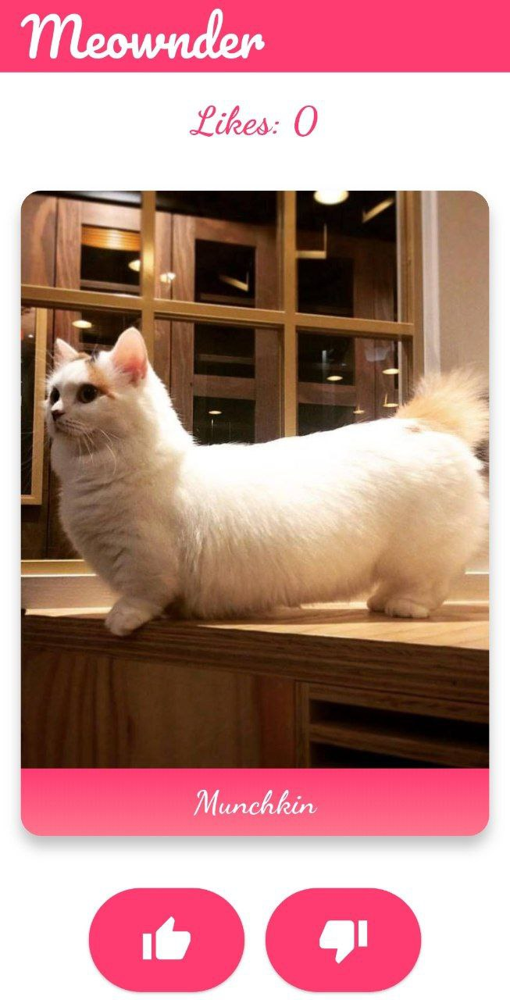
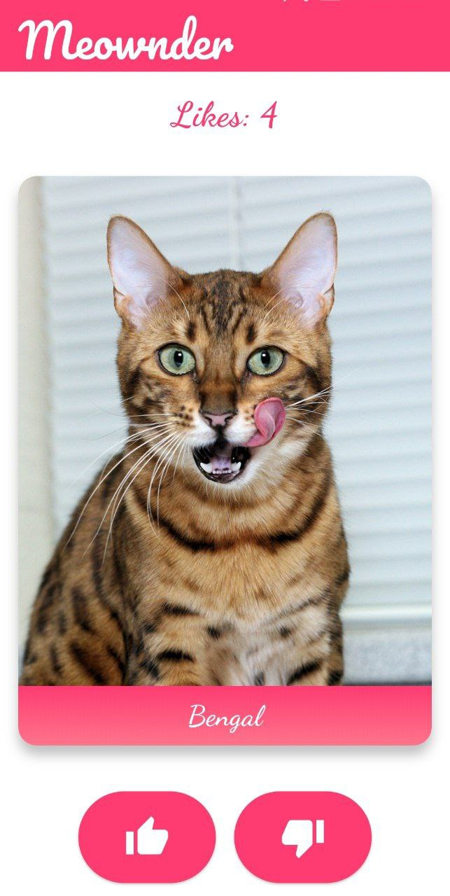

# Meownder
## Tinder для котиков
_Учебный проект на Flutter_

## О проекте

Приложение позволяет просматривать породы котов, ставить лайки и дизлайки свайпом аналогично популярному сервису знакомств.

## Первый этап

В приложении показываются картинки котиков с названием породы. Используется [thecatapi](https://thecatapi.com/) для получении описания и картинок.

- При нажатии на изображении открывается отдельная страница с детальным описанием
- Есть кнопки лайка и дизлайка. При нажатии на них появляется новая порода. Сверху показывается счетчик лайков
- Поставить лайк или дизлайк можно свайпом вправо или влево соответственно

## Скриншоты

## Скачать приложение

- [APK](https://github.com/coolStory24/meownder/raw/master/apk/app-release.apk)
