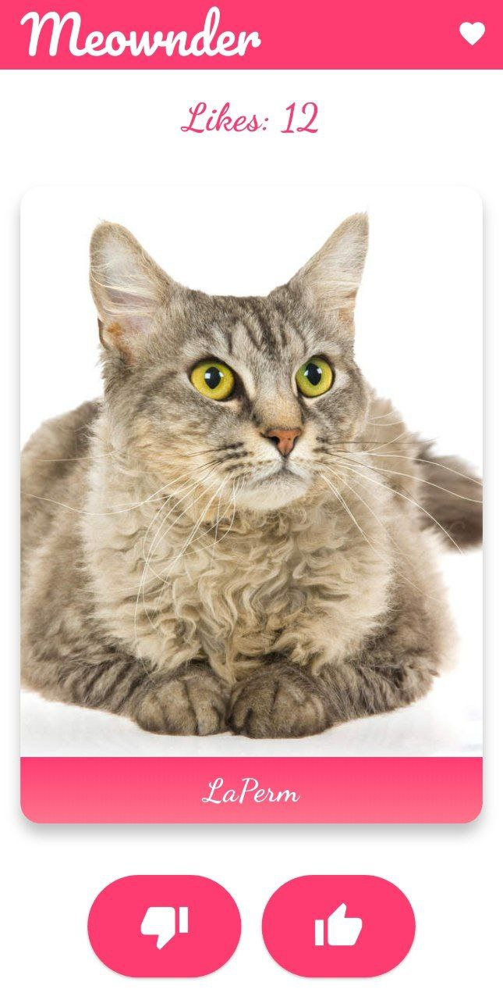
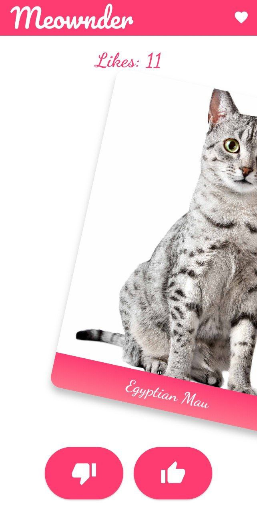
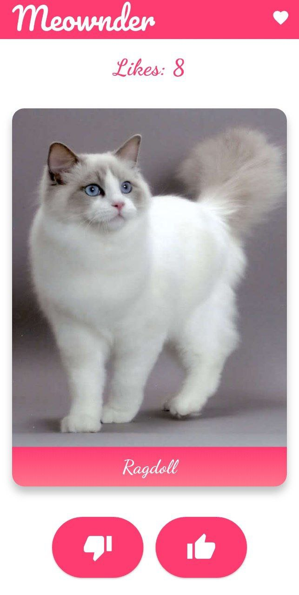
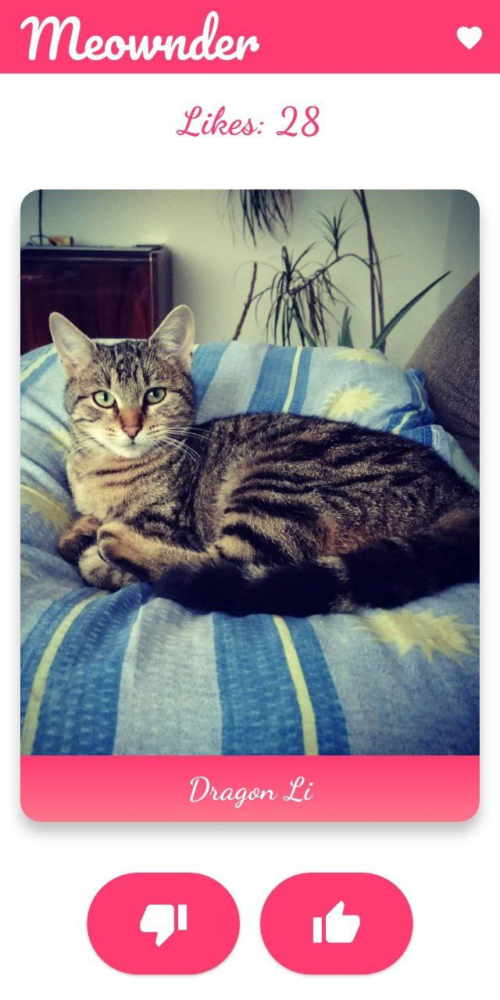
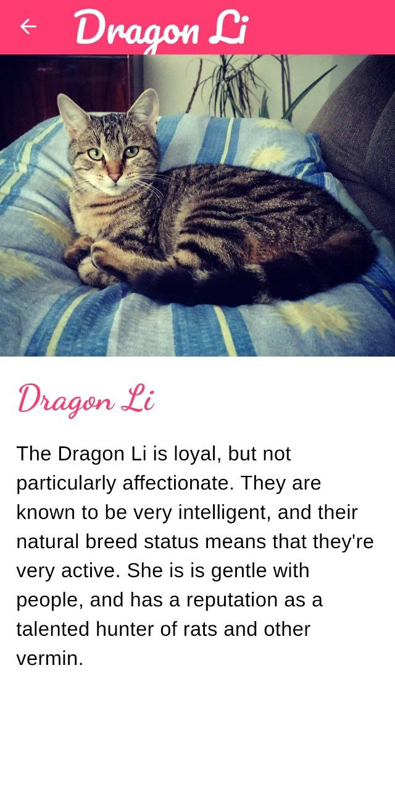
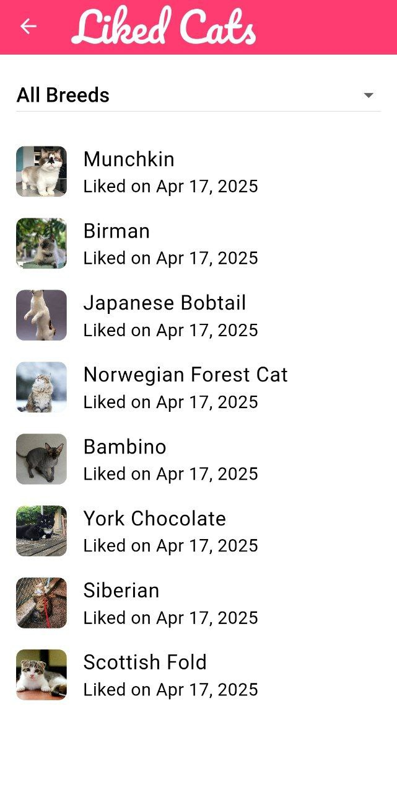
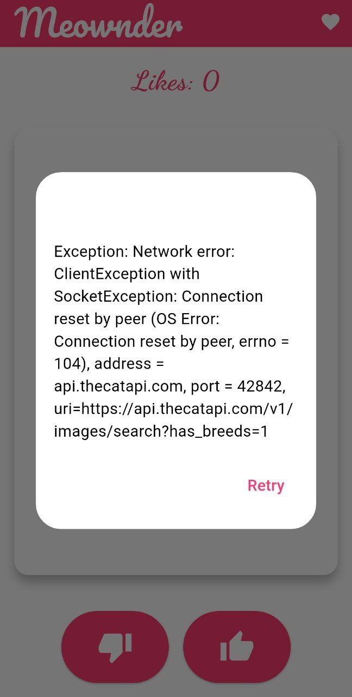
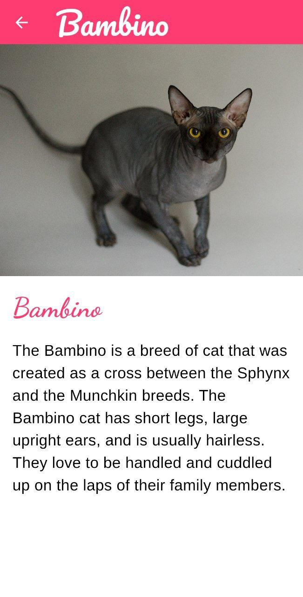

# Meownder
## Tinder для котиков
_Учебный проект на Flutter_

## О проекте

Приложение позволяет просматривать породы котов, ставить лайки и дизлайки свайпом аналогично популярному сервису знакомств.

## Первый этап

В приложении показываются картинки котиков с названием породы. Используется [thecatapi](https://thecatapi.com/) для получении описания и картинок.

- При нажатии на изображении открывается отдельная страница с детальным описанием
- Есть кнопки лайка и дизлайка. При нажатии на них появляется новая порода. Сверху показывается счетчик лайков
- Поставить лайк или дизлайк можно свайпом вправо или влево соответственно

## Второй этап

- Появляется экран лайкнутых котиков (нужно нажать на сердечко в правом верхнем углу)
- На этом экране можно выбрать конкретную породу в выпадающем списке или удалить кота свайпом влево
- Дополнительно можно перейти на детальное описание кота нажатием
- Используется модульная структура, `Bloc` для работы с состояниями
- При ошибке сети выводится сообщение во всплывающем окне для пользователя
- Кнопки лайка и дизлайка перемещены вправо и влево соответственно для большей интуитивности пользовательского интерфейса
- **API** ключ перенесен в `.env`

## Скриншоты

 
 
 

 

## Скачать приложение

- [APK](https://github.com/coolStory24/meownder/raw/task_2/apk/app-release.apk)
